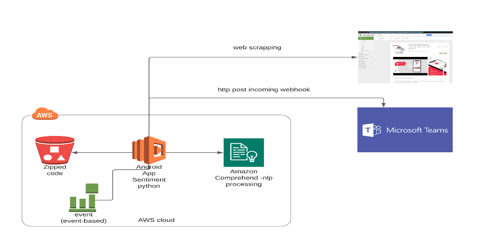

# android-sentiment-analysis
AWS python lambda gather information from android market and obtain sentiment analysis using comprehend service

## AWS Architecture overview


## Preconditions

Ask for aws credentials.
Install aws cli tools.
## Installation

```python
If you need a new lib, add in requeriments.txt
```

## Usage

### Create zip
```
./create-zip-to-lambda.sh
```

### Update zip
Execute if only script file is changed
```
./update-zip-to-lambda.sh
```

### Deploy to s3
```
./deploy-to-s3-lambda.sh
```
